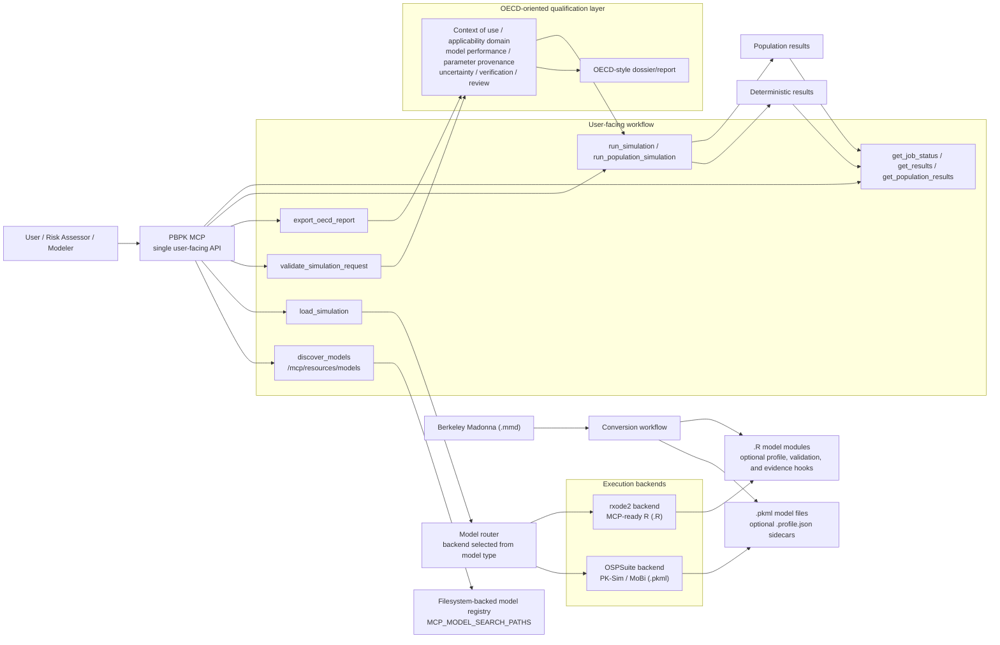

# PBPK MCP

Accessible PBPK workflows through one MCP interface, with explicit OECD-oriented qualification metadata for risk assessment.

Current release: `v0.2.3`

PBPK MCP exposes a single user-facing workflow while routing execution to the appropriate backend:

- `ospsuite` for PK-Sim and MoBi simulation-transfer files (`.pkml`)
- `rxode2` for MCP-ready custom and population-oriented R models (`.R`)

`rxode2` is a native execution engine in this project. It is not limited to Berkeley Madonna conversions.

The design goal is simple:

- one PBPK MCP surface for users
- automatic backend selection from model type
- explicit model discovery and qualification metadata
- clear separation between `runnable` and `scientifically qualified`

## Architecture



For the runtime/deployment view behind this diagram, see [`docs/architecture/dual_backend_pbpk_mcp.md`](docs/architecture/dual_backend_pbpk_mcp.md).

## What Changed Since `v0.2.0`

- added dual-backend routing for `.pkml` and MCP-ready `.R`
- added generic model discovery from disk through `discover_models` and `/mcp/resources/models`
- added OECD-style model `profile` metadata and preflight validation through `validate_simulation_request`
- added explicit OECD-style `modelPerformance` and `parameterProvenance` profile sections
- added `export_oecd_report` for structured dossier/report export across supported backends
- added sidecar-backed scientific metadata for OSPSuite `.pkml` models
- added support for `rxode2` population simulations in the dedicated worker image
- clarified `rxode2` as a direct PBPK execution backend for R-authored models
- added a stable enhanced MCP response contract with `tool` and `contractVersion`
- improved async result chaining with flattened `get_job_status` fields

## Supported Model Types

Directly supported runtime formats:

- `.pkml` through `ospsuite`
- `.R` through the PBPK R model-module contract

Direct R support means you can author and run PBPK models directly against the `rxode2` backend without Berkeley Madonna in the loop.

Conversion source only:

- Berkeley Madonna `.mmd`

Important boundary:

- `.mmd` is not a runtime backend
- the MCP does not execute Berkeley Madonna files directly
- `.mmd` should be converted into `.pkml` or MCP-ready `.R`

## Core Workflow

The intended user workflow is:

1. discover a model
2. load it
3. validate the intended use
4. run deterministic or population simulation
5. retrieve results

The main enhanced MCP surfaces are:

- `discover_models`
- `load_simulation`
- `validate_simulation_request`
- `run_simulation`
- `run_population_simulation`
- `export_oecd_report`
- `get_job_status`
- `get_results`
- `get_population_results`

The enhanced response contract currently uses:

- `contractVersion = pbpk-mcp.v1`

## Model Discovery

PBPK MCP now separates:

- loaded simulation sessions
  - `/mcp/resources/simulations`
- discoverable model files on disk
  - `/mcp/resources/models`
  - `discover_models`

This means a model can exist in the workspace before it has been loaded into a live session.

Discovery is filesystem-backed and generic across `MCP_MODEL_SEARCH_PATHS`:

- supported `.pkml` and `.R` files are scanned from disk
- newly added model files under `var/models` become discoverable automatically
- discovery reports whether a model is `discovered` or already `loaded`
- once loaded, discovery entries are enriched with metadata, capabilities, profile, and loaded simulation IDs

## OECD-Oriented Qualification

This MCP is designed to be usable for risk-assessment workflows, but it is explicit about qualification state.

The server distinguishes between:

- runtime guardrails
  - parameter bounds and request-shape validation
- scientific profile metadata
  - context of use, applicability domain, model performance, parameter provenance, uncertainty, implementation verification, peer review, and traceability

The main preflight surface is:

- `validate_simulation_request`
- `export_oecd_report`

It returns:

- normalized errors and warnings
- `validation.assessment`
- readiness labels such as `runtime-only`, `illustrative-only`, or `research-use`
- a structured `oecdChecklist`
- an `oecdChecklistScore`
- missing-evidence hints when a model is runnable but not well-qualified
- an exportable dossier/report that can include performance evidence and a parameter provenance table

This is the key distinction for public positioning:

- executable does not mean qualified
- in-bounds does not mean suitable for regulatory or risk-assessment use

## What Counts As A Supported R Model

An `.R` model is discoverable if it is placed under `MCP_MODEL_SEARCH_PATHS`, but it is only runnable if it follows the MCP R model contract.

Typical hooks include:

- `pbpk_default_parameters()`
- `pbpk_run_simulation(...)`
- `pbpk_run_population(...)`
- `pbpk_model_profile()`
- `pbpk_validate_request(...)`

The richer the hook set, the richer the discovery and qualification metadata.

Useful optional hooks for OECD-oriented reporting include:

- `pbpk_parameter_table(...)`
  - return a structured parameter table with provenance fields, defaults, and bounds
- `pbpk_performance_evidence(...)`
  - return structured model-performance evidence rows for dossier export
- richer `pbpk_model_profile()` sections for:
  - `modelPerformance`
  - `parameterProvenance`

## PK-Sim And MoBi Support

OSPSuite `.pkml` models are supported through the same user-facing MCP workflow.

They can optionally declare OECD-style metadata through JSON sidecars:

- `model.profile.json`
- `model.pbpk.json`

That allows PK-Sim and MoBi transfer files to remain first-class while still exposing context-of-use and applicability metadata.

## Direct `rxode2` Use

`rxode2` is not only for converted models. Native PBPK models authored directly in R can be loaded and run through the MCP as long as they implement the PBPK R model contract.

Example `load_simulation` call for a native `rxode2` model:

```json
{
  "tool": "load_simulation",
  "arguments": {
    "filePath": "/app/var/models/rxode2/cisplatin/cisplatin_population_rxode2_model.R",
    "simulationId": "cisplatin-rxode2"
  }
}
```

For the full adapter contract and example flows, see [`docs/integration_guides/rxode2_adapter.md`](docs/integration_guides/rxode2_adapter.md).

## OECD Dossier Export

PBPK MCP can now export a structured OECD-style dossier/report for any loaded supported model through:

- `export_oecd_report`

The exported report bundles:

- model identity and backend metadata
- normalized `profile` metadata
- the latest `validation` assessment
- `oecdChecklist` and `oecdChecklistScore`
- missing-evidence hints
- structured performance evidence when declared by the model or sidecar
- an optional parameter table with provenance and current values

This is intended to support qualification review and risk-assessment workflows without pretending that every executable model is already externally qualified.

## Quick Start

Build the dedicated `rxode2` worker image:

```bash
./scripts/build_rxode2_worker_image.sh
```

Deploy the local Celery stack:

```bash
./scripts/deploy_rxode2_stack.sh
```

Check the host-exposed API:

```bash
curl -s http://127.0.0.1:8000/health
```

The local stack exposes:

- `pbpk_mcp-api-1` on `http://127.0.0.1:8000`
- `pbpk_mcp-worker-1` on the same worker image for execution
- `pbpk_mcp-redis-1` for job brokering and result storage

## Regression Tests

Bridge and profile normalization tests:

```bash
python3 -m unittest -v tests/test_oecd_bridge.py
```

Live OECD smoke tests:

```bash
python3 -m unittest -v tests/test_oecd_live_stack.py
```

Release-readiness check against the running local stack:

```bash
python3 scripts/release_readiness_check.py
```

Live model discovery tests:

```bash
python3 -m unittest -v tests/test_model_discovery_live_stack.py
```

These checks cover:

- cisplatin discoverability before preload
- automatic discovery of newly added model files
- enrichment of discovery entries after load
- OECD-style validation for both `rxode2` and `ospsuite` flows

## Limitations

Current hard limitations:

- raw Berkeley Madonna `.mmd` files are not directly executable
- only `.pkml` and MCP-ready `.R` are supported runtime formats
- PK-Sim / MoBi project files such as `.pksim5` are not loaded directly and should be exported to `.pkml`
- an `.R` file can be discoverable without being runnable if it does not implement the required contract
- not every model ships a complete scientific qualification package
- many example sidecars are still illustrative rather than dossier-grade
- backend capabilities are intentionally not identical across `ospsuite` and `rxode2`
- population simulation is currently implemented for `rxode2` models, not generic OSPSuite `.pkml` sessions

Current qualification limitations:

- runtime guardrails are not the same as external scientific validation
- `research-use` or `illustrative-example` models should not be represented as regulatory-ready
- OECD-style metadata completeness can be high while scientific evidence is still incomplete
- exported `performanceEvidence` may still reflect runtime or smoke-test evidence rather than observed-versus-predicted qualification datasets
- parameter provenance may be structured and exportable while still lacking full per-parameter citations, study conditions, or identifiability evidence

Current operational limitations:

- `rxode2` image builds are heavy and should be prebuilt rather than compiled in a capped runtime worker
- runtime workers should stay conservatively capped, such as `4 GiB`
- the durable `rxode2` image build can take a long time on laptop hardware because of C/C++ compilation

## Repository Guide

Key implementation points:

- [`scripts/ospsuite_bridge.R`](scripts/ospsuite_bridge.R)
- [`patches/mcp_bridge/model_catalog.py`](patches/mcp_bridge/model_catalog.py)
- [`patches/mcp/tools/discover_models.py`](patches/mcp/tools/discover_models.py)
- [`patches/mcp/tools/validate_simulation_request.py`](patches/mcp/tools/validate_simulation_request.py)
- [`docker-compose.celery.yml`](docker-compose.celery.yml)

Supporting docs:

- [`docs/architecture/dual_backend_pbpk_mcp.md`](docs/architecture/dual_backend_pbpk_mcp.md)
- [`docs/architecture/mcp_payload_conventions.md`](docs/architecture/mcp_payload_conventions.md)
- [`docs/integration_guides/rxode2_adapter.md`](docs/integration_guides/rxode2_adapter.md)
- [`docs/integration_guides/ospsuite_profile_sidecars.md`](docs/integration_guides/ospsuite_profile_sidecars.md)
- [`docs/deployment/rxode2_worker_image.md`](docs/deployment/rxode2_worker_image.md)
- [`CHANGELOG.md`](CHANGELOG.md)
- [`docs/releases/`](docs/releases/)
- [`docs/github_publication_checklist.md`](docs/github_publication_checklist.md)
