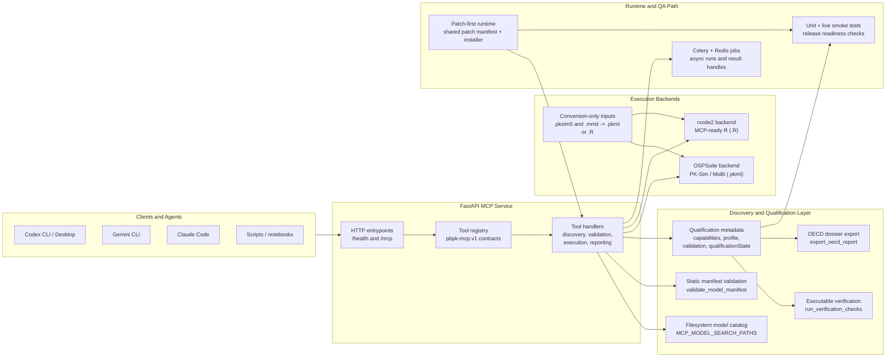

# PBPK MCP Server

[](https://github.com/ToxMCP/pbpk-mcp/actions/workflows/ci.yml)
[](https://doi.org/10.64898/2026.02.06.703989)
[](./LICENSE)
[](https://github.com/ToxMCP/pbpk-mcp/releases)
[](https://www.python.org/)

> Part of **ToxMCP** Suite → https://github.com/ToxMCP/toxmcp

**Public MCP endpoint for physiologically based pharmacokinetic (PBPK) simulation, qualification, and dossier export.**  
Expose PK-Sim / MoBi `.pkml`, MCP-ready `rxode2` `.R`, deterministic and population runs, and OECD-oriented validation/reporting to any MCP-aware agent (Codex CLI, Gemini CLI, Claude Code, etc.).

## Architecture



The current implementation follows a layered model:

- `FastAPI + JSON-RPC` expose `/mcp` and `/health`, and keep transport concerns separate from PBPK model logic.
- `Tool handlers` are the agent-facing API. They validate inputs, call adapters, and emit structured responses with normalized `pbpk-mcp.v1` payloads.
- `Discovery and manifest validation` make model files visible before load, and keep curation checks separate from runtime execution.
- `Execution backends` route `.pkml` files to `ospsuite` and MCP-ready `.R` modules to `rxode2`, while treating `.pksim5` and `.mmd` as conversion-only inputs.
- `Qualification metadata` keeps `capabilities`, `profile`, `validation`, and `qualificationState` separate so runnable does not get conflated with scientifically qualified.
- `Executable verification` adds lightweight but structured runtime checks on top of qualification metadata, including parameter-unit consistency, structural flow/volume consistency, deterministic smoke, result-integrity, and repeat-run reproducibility checks without conflating them with formal qualification evidence.
- `Patch-first runtime + smoke tests` keep the documented tool surface synchronized with the live API during the current `v0.3.5` convergence stage.
- `Release metadata checks` now verify that package version markers, compose/env `SERVICE_VERSION`, README release markers, the top changelog entry, and the matching `docs/releases/` note stay aligned.
- `Release artifact evidence` now retains a machine-readable report with `sdist`/wheel hashes and the linked contract-manifest identity during tag builds.

See `docs/architecture/dual_backend_pbpk_mcp.md` for the fuller architecture narrative, `docs/architecture/capability_matrix.md` for the published support matrix, `docs/architecture/mcp_payload_conventions.md` for the response contract, and `docs/deployment/runtime_patch_flow.md` for the operator path behind the current local deployment model.

## What's new in v0.3.5

- Added typed external uncertainty handoff references and stricter PBPK-side uncertainty semantics for quantified versus declared-only uncertainty evidence.
- Strengthened predictive-evidence traceability with supplement consistency checks against declared datasets, target outputs, and acceptance criteria.
- Added deploy-path readiness stabilization so patch-first redeploys wait for stable `/health` and `/mcp/list_tools` responses before returning.
- Preserved the explicit PBPK/NGRA boundary: PBPK MCP exports qualified PBPK-side objects and evidence, but still does not calculate BER or make assessment decisions.
- Re-verified the release against the live stack and the clean-clone contract suite.

## Why this project exists

PBPK workflows often juggle PK-Sim or MoBi transfer files, R-authored mechanistic models, runtime-specific scripts, and incomplete qualification notes. That makes them difficult for coding agents to automate safely and difficult for reviewers to inspect consistently.

The PBPK MCP server wraps those workflows in a **single, programmable interface**:

- **Unified MCP surface** – discovery, manifest checks, load, validation, execution, results, and dossier export share one tool catalog.
- **Dual-backend execution** – `.pkml` models run on `ospsuite`; MCP-ready `.R` models run on `rxode2`.
- **Qualification-aware workflows** – runtime capability, scientific profile, preflight validation, and derived `qualificationState` stay separate.
- **NGRA-ready PBPK objects** – validation and dossier export expose PBPK-side typed objects such as `assessmentContext`, `pbpkQualificationSummary`, `uncertaintySummary`, `uncertaintyHandoff`, `internalExposureEstimate`, a typed external uncertainty-register reference, and a typed external PoD reference handoff, now with explicit boundary/support metadata plus additive `semanticCoverage` for PBPK-side uncertainty semantics, without collapsing PBPK MCP into a full decision engine.
- **Traceable predictive evidence** – performance bundles can now carry traceability supplements, and the report path now warns when bundled benchmark rows do not actually line up with the declared datasets, target outputs, or acceptance criteria.
- **Discovery before execution** – models are discoverable from disk before they are loaded into a live session.
- **Release-tested local deployment** – the patch-first runtime is continuously exercised with unit tests, live-stack tests, and a readiness check.
- **Model-specific executable qualification checks** – MCP-ready models can add runtime verification hooks for checks such as flow/volume consistency, mass balance, or numerical stability without overstating regulatory qualification.

> `rxode2` is a native PBPK execution engine in this project. It is not limited to Berkeley Madonna conversion workflows.

---

## Feature snapshot

| Capability | Description |
| --- | --- |
| 🧬 **Dual-backend PBPK execution** | Route `.pkml` models to `ospsuite` and MCP-ready `.R` models to `rxode2` through one MCP surface. |
| 🗂️ **Model discovery and curation** | Discover supported model files from `MCP_MODEL_SEARCH_PATHS`, inspect unloaded models, and run static manifest checks before load. |
| 🛡️ **OECD-oriented qualification** | Keep `capabilities`, `profile`, `validation`, and `qualificationState` explicit; expose applicability, provenance, uncertainty, implementation verification, software-platform qualification, and qualification gaps. |
| 🧱 **NGRA-ready PBPK objects** | Emit typed PBPK-side objects such as `assessmentContext`, `pbpkQualificationSummary`, `uncertaintySummary`, `uncertaintyHandoff`, `internalExposureEstimate`, a typed `uncertaintyRegisterReference`, a typed `pointOfDepartureReference`, and a thin BER-ready reference bundle in dossier export, with explicit boundary/support flags plus additive uncertainty `semanticCoverage` for downstream NGRA orchestration and without embedding BER decision logic in PBPK MCP. |
| 📐 **Published object schemas** | Publish machine-readable JSON Schemas and example payloads for the PBPK-side NGRA handoff object family under `schemas/` so downstream tooling can validate the public object layer directly. |
| 🔌 **External PBPK normalization** | Normalize externally generated PBPK outputs, qualification metadata, and optional PoD references through `ingest_external_pbpk_bundle` without pretending PBPK MCP executed the upstream engine. |
| ✅ **Executable verification** | Run `run_verification_checks` to capture preflight validation, parameter coverage, parameter-unit consistency, structural flow/volume consistency, deterministic smoke, deterministic result integrity, repeat-run reproducibility, optional population smoke, and verification-evidence summaries in one payload. |
| 📈 **Deterministic and population jobs** | Submit asynchronous deterministic and population simulations, then retrieve result handles, stored results, and PK summaries. |
| 🧾 **Dossier export** | Export a structured OECD-style report with model metadata, validation context, checklist state, parameter provenance, performance evidence, uncertainty evidence, verification evidence, and software-platform qualification evidence when declared. |
| ⚙️ **Patch-first deployment hygiene** | Recreate the local stack and reapply the exact documented runtime patch set through shared patch-install tooling. |
| 🤖 **Agent friendly** | Verified through MCP HTTP surfaces such as `/mcp/list_tools`, `/mcp/call_tool`, and `/mcp/resources/models`, with live-stack regression checks. |

---

## Table of contents

1. [Architecture](#architecture)
2. [Published schemas](#published-schemas)
3. [Capability matrix](#capability-matrix)
4. [Quick start](#quick-start)
5. [Configuration](#configuration)
6. [Tool catalog](#tool-catalog)
7. [Running the server](#running-the-server)
8. [Integrating with coding agents](#integrating-with-coding-agents)
9. [Output artifacts](#output-artifacts)
10. [Security checklist](#security-checklist)
11. [Current limitations](#current-limitations)
12. [Development notes](#development-notes)
13. [Contributing](#contributing)
14. [Security policy](#security-policy)
15. [Code of conduct](#code-of-conduct)
16. [Citation](#citation)
17. [Roadmap](#roadmap)
18. [License](#license)

---

## Quickstart TL;DR

```bash
# 1) build the worker image
git clone https://github.com/ToxMCP/pbpk-mcp.git
cd pbpk-mcp

# 2) start the local stack
./scripts/build_rxode2_worker_image.sh
./scripts/deploy_rxode2_stack.sh

# 3) verify
curl -s http://localhost:8000/health | jq .
curl -s http://localhost:8000/mcp/list_tools | jq '.tools[].name'
```

## Published schemas

The PBPK-side NGRA handoff objects are now published as machine-readable JSON Schemas under `schemas/`, with matching examples under `schemas/examples/`.

Published object family:

- `schemas/assessmentContext.v1.json`
- `schemas/pbpkQualificationSummary.v1.json`
- `schemas/uncertaintySummary.v1.json`
- `schemas/uncertaintyHandoff.v1.json`
- `schemas/uncertaintyRegisterReference.v1.json`
- `schemas/internalExposureEstimate.v1.json`
- `schemas/pointOfDepartureReference.v1.json`
- `schemas/berInputBundle.v1.json`

Design intent:

- require the stable core fields only
- allow additive convenience fields
- keep BER calculation and final decision policy outside PBPK MCP
- make the PBPK-side handoff layer consumable by downstream validators and orchestrators without scraping examples out of tests

See `schemas/README.md` for the short schema guide and `tests/test_ngra_object_schemas.py` for the validation gate that keeps the published schemas aligned with live payload generation. The same schema family is also exposed through the live MCP resource surface at `/mcp/resources/schemas`. In the current patch-first runtime, the generic Python runtime now comes from the packaged `src/` tree exposed at `/app/src` and activated through `scripts/runtime_src_overlay.pth`, and the live schema/capability/contract-manifest resources now treat the packaged `mcp_bridge.contract` content as authoritative rather than depending on copied JSON under `/app/var/contract`. `scripts/check_installed_package_contract.py` is the maintainer gate that proves the generated package fallback still matches the published JSON artifacts after a non-editable local install.

PBPK MCP now also publishes a machine-readable contract manifest in:

- `docs/architecture/contract_manifest.json`
- `/mcp/resources/contract-manifest`

That manifest inventories the published PBPK-side schema family, the capability matrix, the legacy artifacts intentionally excluded from the PBPK-side object family, and the stable resource endpoints that expose the contract.
The live schema, capability-matrix, and contract-manifest resources now also expose SHA-256 values so downstream clients can verify that the running API matches the published artifact inventory.
The shared schema/capability/contract-manifest route logic now lives in packaged `src/mcp_bridge/routes/resources_base.py`, and packaged `src/mcp_bridge/routes/resources.py` now owns the full generic `/mcp/resources` surface including `/mcp/resources/models`.
The same is now true for tools as well: packaged `src/mcp_bridge/tools/registry_base.py` and `src/mcp_bridge/tools/registry.py` now own the generic discovery/static-manifest/result/import descriptors alongside the rest of the documented PBPK workflow surface.
The next `0.4.x` debt-reduction slices are now live too: generic discovery, manifest, load/session-status, preflight validation, executable verification, dossier export, deterministic-result retrieval, external-import normalization, population workflow tools, the shared `model_catalog` / `model_manifest` helpers, the top-level `mcp` namespace, and the generic adapter contract/runtime now live in packaged `src/`. The current runtime patch flow now relies on the packaged `src/` tree already present in the image or bind-mounted at `/app/src`, with `scripts/runtime_src_overlay.pth` acting as the only Python overlay hook instead of re-copying those trees during patch install.

## Capability matrix

PBPK MCP now publishes a dedicated capability matrix for adopters in:

- `docs/architecture/capability_matrix.md`
- `docs/architecture/capability_matrix.json`

The machine-readable matrix is also exposed from the running server at `/mcp/resources/capability-matrix`.

This matrix is the crisp public answer to:

- what is discoverable
- what is statically validatable
- what is loadable
- what is deterministic-run capable
- what is population-run capable
- what is dossier-capable

Current headline boundaries:

- `.pkml` is discoverable, loadable, validatable, verification-capable, deterministic-run capable, and dossier-capable through `ospsuite`
- contract-complete MCP-ready `.R` is discoverable, loadable, validatable, verification-capable, deterministic-run capable, and dossier-capable through `rxode2`
- population execution is currently `rxode2`-only and remains conditional on model capability
- incomplete `.R` files may still be discoverable before they are runnable
- `.pksim5` and `.mmd` are conversion-only and do not appear as runtime-supported catalog entries

The machine-readable JSON file is intentionally small and stable so downstream tooling can consume it directly without scraping prose from the README.

`scripts/generate_contract_artifacts.py --check` is the maintainer gate that keeps the contract manifest and generated packaged fallback aligned with the published JSON artifacts.

## Quick start

```bash
git clone https://github.com/ToxMCP/pbpk-mcp.git
cd pbpk-mcp

./scripts/build_rxode2_worker_image.sh
./scripts/deploy_rxode2_stack.sh
```

> **Heads-up:** The current local deployment is intentionally patch-first. `./scripts/deploy_rxode2_stack.sh` recreates the stack and reapplies the current runtime patch set so the live API matches the documented `v0.3.5` contract.
> It now also waits for stable `/health` and `/mcp/list_tools` responses before returning, so immediate live-stack checks do not race a restarting API process.

Once the server is running:

- HTTP MCP endpoint: `http://localhost:8000/mcp`
- Health check: `http://localhost:8000/health`
- Model discovery resource: `http://localhost:8000/mcp/resources/models`
- Architecture docs: `docs/architecture/dual_backend_pbpk_mcp.md`
- Runtime operator docs: `docs/deployment/runtime_patch_flow.md`

## Verification (smoke test)

Once the server is running:

```bash
# health
curl -s http://localhost:8000/health | jq .

# list MCP tools
curl -s http://localhost:8000/mcp/list_tools | jq .

# discover cisplatin
curl -s -X POST http://localhost:8000/mcp/call_tool \
  -H "Content-Type: application/json" \
  -d '{"tool":"discover_models","arguments":{"search":"cisplatin","limit":10}}' | jq .

# static manifest validation
curl -s -X POST http://localhost:8000/mcp/call_tool \
  -H "Content-Type: application/json" \
  -d '{"tool":"validate_model_manifest","arguments":{"filePath":"/app/var/models/rxode2/cisplatin/cisplatin_population_rxode2_model.R"}}' | jq .
```

For the full live-stack gate, run:

```bash
python3 scripts/release_readiness_check.py
```

To smoke-test the actual discovered model inventory in the current workspace, run:

```bash
python3 scripts/workspace_model_smoke.py
python3 scripts/workspace_model_smoke.py --include-population
```

The script discovers runtime-supported models through `/mcp/resources/models`, runs static manifest validation, loads each model, submits a deterministic simulation, retrieves stored results, and optionally runs a small population smoke for `rxode2` models that declare population support. It writes a JSON report to `var/workspace_model_smoke_report.json`.

For the GitHub-hosted verification path, the repository also carries:

- a lightweight `CI` workflow for patch/runtime contract checks on pushes and pull requests
- a heavier `Model Smoke` workflow that builds the Docker-backed stack, runs the live readiness gate, executes `workspace_model_smoke.py --include-population`, and uploads the resulting JSON reports as workflow artifacts

---

## Configuration

The default developer stack is defined in `docker-compose.celery.yml`. A stricter operator overlay is now available in `docker-compose.hardened.yml` for deployments that should disable anonymous access and require explicit auth configuration. Key environment variables currently shaping the runtime are:

| Variable | Default | Description |
| --- | --- | --- |
| `MCP_MODEL_SEARCH_PATHS` | `/app/var` | Filesystem roots scanned by `discover_models` and `/mcp/resources/models`. |
| `ADAPTER_BACKEND` | `subprocess` | Uses the R / OSPSuite subprocess bridge instead of an in-memory mock path. |
| `JOB_BACKEND` | `celery` | Enables asynchronous job submission through Redis-backed Celery workers. |
| `CELERY_BROKER_URL` | `redis://redis:6379/0` | Queue broker for asynchronous jobs. |
| `CELERY_RESULT_BACKEND` | `redis://redis:6379/1` | Result storage for job handles and async result chaining. |
| `R_PATH` / `R_HOME` | container defaults | Point the bridge to the R runtime used by `rxode2` and OSPSuite tooling. |
| `R_MAX_VSIZE` | `2G` | Caps R virtual memory use inside the current local worker setup. |
| `DOTNET_GCHeapLimitPercent` | `60` | Constrains the .NET heap used by the OSPSuite runtime. |
| `SERVICE_VERSION` | `0.3.5` | Exposed through `/health` and compose-level runtime metadata. |
| `AUTH_ALLOW_ANONYMOUS` | `true` | Development-friendly local default; do not expose beyond localhost without hardening. |
| `PBPK_BIND_HOST` | `127.0.0.1` | Host/interface used by the hardened overlay when publishing the API port. |
| `PBPK_BIND_PORT` | `8000` | Host port used by the hardened overlay when publishing the API port. |
| `AUTH_ISSUER_URL` | unset | Required by the hardened overlay. OIDC issuer used for token validation. |
| `AUTH_AUDIENCE` | unset | Required by the hardened overlay. Audience expected in bearer tokens. |
| `AUTH_JWKS_URL` | unset | Required by the hardened overlay. JWKS endpoint used to validate bearer tokens. |

For local development, keep using `docker-compose.celery.yml` through `./scripts/deploy_rxode2_stack.sh`. For a more production-like local or operator-managed deployment, use `./scripts/deploy_hardened_stack.sh`, which layers `docker-compose.hardened.yml` over the same patch-first runtime flow and waits for stable readiness before returning.

See `docker-compose.celery.yml`, `docker-compose.hardened.yml`, `docs/deployment/runtime_patch_flow.md`, and `docs/deployment/rxode2_worker_image.md` for the current operator-facing deployment surface.

---

## Tool catalog

| Category | Highlight tools | Notes |
| --- | --- | --- |
| Discovery and curation | `discover_models`, `validate_model_manifest`, `load_simulation` | Discover models before load, inspect static manifest state, and load supported `.pkml` or MCP-ready `.R` files into the live session registry. |
| Qualification and reporting | `validate_simulation_request`, `run_verification_checks`, `export_oecd_report`, `ingest_external_pbpk_bundle` | Run OECD-oriented preflight checks, executable verification with unit/integrity/reproducibility checks, structured dossier export with `profile`, `validation`, `qualificationState`, evidence sections, and a descriptive `oecdCoverage` map to OECD Tables 3.1/3.2, and normalize externally generated PBPK outputs into the same typed PBPK-side objects. |
| Simulation control | `list_parameters`, `get_parameter_value`, `set_parameter_value`, `run_simulation` | Inspect and modify simulation parameters, then submit deterministic runs asynchronously. |
| Async status and results | `get_job_status`, `get_results`, `calculate_pk_parameters`, `cancel_job` | Track async jobs, retrieve stored deterministic results, compute PK summaries, and cancel queued/running jobs. |
| Population and exploration | `run_population_simulation`, `get_population_results`, `run_sensitivity_analysis` | Run population workflows and sensitivity analyses on the backends that declare those capabilities. |

The normalized `pbpk-mcp.v1` contract currently applies to:

- `load_simulation`
- `validate_model_manifest`
- `validate_simulation_request`
- `run_verification_checks`
- `export_oecd_report`
- `get_job_status`
- `get_results`

### Example workflow

For the current public workflow:

1. Call `discover_models` or inspect `/mcp/resources/models`.
2. Call `validate_model_manifest` before loading a new model.
3. Call `load_simulation`.
4. Call `validate_simulation_request` for the intended context of use.
5. Call `run_verification_checks` when you want a lightweight executable verification summary before broader use or release.
6. Submit `run_simulation` or `run_population_simulation`.
7. Poll `get_job_status`, then fetch `get_results` or `get_population_results`.
8. Call `export_oecd_report` when you need a dossier/report package.

### Supported model policy

Supported runtime inputs:

- `.pkml` via `ospsuite`
- MCP-ready `.R` via `rxode2`

Conversion-only inputs:

- `.pksim5` PK-Sim project files
- Berkeley Madonna `.mmd`

Both conversion-only formats are rejected early with explicit guidance to export to `.pkml` or convert to an MCP-ready `.R` model.

Qualification model:

PBPK MCP keeps these concepts separate:

- `capabilities` for operational/runtime support
- `profile` for declared scientific metadata
- `validation` for preflight applicability and guardrail assessment
- `qualificationState` for the derived summary label
- `ngraObjects` for PBPK-side typed NGRA-ready objects such as `assessmentContext`, `pbpkQualificationSummary`, `uncertaintySummary`, `uncertaintyHandoff`, `internalExposureEstimate`, and `uncertaintyRegisterReference`
  - `uncertaintySummary` now also carries additive `semanticCoverage` so downstream consumers can distinguish declared-only versus quantified PBPK-side variability, sensitivity, and residual uncertainty without inferring that from raw evidence rows alone; it now includes `quantifiedRowCount`, `declaredOnlyRowCount`, and a stricter `variabilityQuantificationStatus`
- `oecdCoverage` for a descriptive mapping from exported dossier fields onto OECD reporting-template and evaluation-checklist sections; it does not modify `oecdChecklistScore` or qualification state

Current derived qualification states include:

- `exploratory`
- `illustrative-example`
- `research-use`
- `regulatory-candidate`
- `qualified-within-context`

This is the core policy boundary for the server:

- executable does not mean qualified
- in-bounds does not mean suitable for regulatory use

For `.R` models, richer OECD-oriented reporting is enabled by hooks such as:

- `pbpk_model_profile()`
- `pbpk_validate_request(...)`
- `pbpk_parameter_table(...)`
- `pbpk_performance_evidence(...)`
- `pbpk_uncertainty_evidence(...)`
- `pbpk_verification_evidence(...)`
- `pbpk_run_verification_checks(...)`
- `pbpk_platform_qualification_evidence(...)`

For example, the cisplatin `rxode2` model now exports bounded local sensitivity evidence and a compact variability-propagation summary through `uncertaintyEvidence`, using the currently loaded parameter state rather than a hard-coded placeholder row. Its `performanceEvidence` is also explicitly classified as runtime-only/internal evidence so executable smoke checks cannot be mistaken for predictive validation.

`export_oecd_report` now also adds `oecdCoverage`, an additive coverage map aligned to OECD PBK Guidance Tables 3.1 and 3.2. It is intentionally descriptive: it shows which dossier sections/questions are covered by the current report payload and which remain incomplete, but it does not alter `oecdChecklistScore`, `qualificationState`, or any downstream decision boundary.

Researchers can also attach generic companion performance bundles next to either `.pkml` or `.R` models without modifying the bridge code. See [performance_evidence_bundles.md](/Volumes/Storage/topotox_offload/20260220_space_relief/manual_offload/PBPK_MCP/docs/integration_guides/performance_evidence_bundles.md) and the starter template at [performance_evidence_bundle.template.json](/Volumes/Storage/topotox_offload/20260220_space_relief/manual_offload/PBPK_MCP/examples/performance_evidence_bundle.template.json). Those bundles can now carry both row-level evidence and a traceability-only `profileSupplement` for predictive dataset records, acceptance criteria, and target outputs. The MCP validates row-level claims conservatively and keeps the supplement descriptive rather than silently upgrading the qualification boundary.

`modelPerformance` can now also declare structured `datasetRecords` and `acceptanceCriteria` inside `goodnessOfFit`, `predictiveChecks`, or `evaluationData`. The bridge normalizes those fields and exposes additive traceability counts so predictive support is not reduced to a single status token.

The same pattern now exists for uncertainty evidence. See [uncertainty_evidence_bundles.md](/Volumes/Storage/topotox_offload/20260220_space_relief/manual_offload/PBPK_MCP/docs/integration_guides/uncertainty_evidence_bundles.md) and [uncertainty_evidence_bundle.template.json](/Volumes/Storage/topotox_offload/20260220_space_relief/manual_offload/PBPK_MCP/examples/uncertainty_evidence_bundle.template.json). The MCP surfaces warnings when uncertainty rows are missing method/summary or scope information, and `variability-propagation` rows are only treated as quantified propagation evidence when they actually include quantitative outputs such as `value`, `lowerBound`, `upperBound`, `mean`, or `sd`.

The same companion-bundle pattern now exists for richer parameter tables. See [parameter_table_bundles.md](/Volumes/Storage/topotox_offload/20260220_space_relief/manual_offload/PBPK_MCP/docs/integration_guides/parameter_table_bundles.md) and [parameter_table_bundle.template.json](/Volumes/Storage/topotox_offload/20260220_space_relief/manual_offload/PBPK_MCP/examples/parameter_table_bundle.template.json). `export_oecd_report` and `validate_model_manifest` now surface row-level coverage for sources, citations, distributions, study conditions, and rationale so dossier gaps are visible without custom bridge code.

Structured peer-engagement traceability can now stay inside the existing `peerReview` profile section. If a model declares `reviewRecords`, `priorRegulatoryUse`, `revisionStatus`, or `revisionHistory`, the bridge now normalizes those fields and exposes dossier-ready coverage counts instead of treating peer review as a single free-text status flag.

For `.pkml` models, richer qualification metadata can be supplied with sidecars such as:

- `model.profile.json`
- `model.pbpk.json`

---

## Running the server

The default local stack is:

- `pbpk_mcp-api-1` on `http://127.0.0.1:8000`
- `pbpk_mcp-worker-1` on the same `pbpk_mcp-worker-rxode2:latest` image for execution
- `pbpk_mcp-redis-1` for job brokering and result storage

The preferred local operator entrypoint is:

```bash
./scripts/deploy_rxode2_stack.sh
```

That command recreates the containers and reapplies the current runtime patch set so the live tool catalog remains aligned with the documented contract.

When you want the same runtime contract with stricter deployment defaults, use:

```bash
AUTH_ISSUER_URL="https://issuer.example" \
AUTH_AUDIENCE="pbpk-mcp" \
AUTH_JWKS_URL="https://issuer.example/.well-known/jwks.json" \
./scripts/deploy_hardened_stack.sh
```

That overlay disables anonymous access, switches the stack to `ENVIRONMENT=production`, binds the published API port through `PBPK_BIND_HOST` / `PBPK_BIND_PORT`, and still reapplies the shared patch manifest before waiting for stable `/health` and `/mcp/list_tools` responses.

---

## Integrating with coding agents

Add `http://localhost:8000/mcp` as an MCP provider in Codex CLI/Desktop, Gemini CLI, Claude Code, or other MCP-aware hosts.

Useful companion surfaces:

- `/mcp/list_tools` for the live tool catalog
- `/mcp/call_tool` for direct HTTP tool execution
- `/mcp/resources/models` for discoverable model files
- `/mcp/resources/simulations` for already-loaded live sessions
- `/mcp/resources/schemas` for the published PBPK-side object schemas and example payloads
- `/mcp/resources/capability-matrix` for the live machine-readable runtime-support matrix

Critical tools still declare MCP-side guardrails such as `critical` and `requiresConfirmation` in the tool catalog. The current live regression suite checks that the documented workflow is actually exposed through `/mcp/list_tools`.

---

## Output artifacts

The server currently produces and exposes:

- discovered model inventories with loaded/unloaded state
- static manifest validation reports
- load-time model metadata with `backend`, `capabilities`, `profile`, `validation`, and `qualificationState`
- validation/report payloads with typed PBPK-side NGRA-ready objects such as `assessmentContext`, `pbpkQualificationSummary`, `uncertaintySummary`, `uncertaintyHandoff`, `internalExposureEstimate`, `uncertaintyRegisterReference`, and `pointOfDepartureReference`
  - uncertainty objects now include machine-readable PBPK-side uncertainty semantics for quantified variability, declared-only residual uncertainty, and still-missing components
- a BER-ready reference bundle in dossier export that can become `ready-for-external-ber-calculation` when an external `podRef` and a resolved PBPK exposure target are both available
- imported external PBPK run records and NGRA-ready object bundles from `ingest_external_pbpk_bundle`
- executable verification summaries with structured check results, smoke-run artifact handles, parameter-unit consistency, result-integrity/reproducibility checks, and verification-evidence snapshots
- deterministic result handles and stored deterministic result payloads
- population summary payloads and chunk handles
- PK metric outputs from `calculate_pk_parameters`
- OECD-style dossier/report exports with checklist state, missing-evidence hints, performance evidence, uncertainty evidence, verification evidence, software-platform qualification evidence, and parameter provenance when declared

---

## Security checklist

- ✅ Dual-backend runtime policy is explicit: `.pkml` and MCP-ready `.R` are supported; `.pksim5` and `.mmd` are conversion-only.
- ✅ Discovery, manifest validation, runtime validation, and OECD dossier export are exposed as separate tool surfaces.
- ✅ `capabilities`, `profile`, `validation`, and `qualificationState` remain distinct, so runtime support is not mislabeled as scientific qualification.
- ✅ The shared runtime patch manifest keeps image builds and hot-patch deployment aligned in the current patch-first stage.
- ✅ Live readiness checks verify `/mcp/list_tools`, `/mcp/resources/models`, discovery parity, and conversion-only rejection behavior.
- ✅ A documented hardened overlay now disables anonymous access by default and requires explicit auth settings before the stack will start.
- 🔲 The default compose file is still development-oriented; keep it on localhost and use the hardened overlay plus environment-specific ingress controls when moving beyond local development.
- 🔲 Qualification evidence completeness still depends on the model or sidecar; executable does not imply regulatory readiness.

## Current limitations

### Format and backend limitations

- Raw Berkeley Madonna `.mmd` files are not directly executable.
- Only `.pkml` and MCP-ready `.R` are supported runtime formats.
- PK-Sim / MoBi project files such as `.pksim5` are not loaded directly and must be exported to `.pkml`.
- An `.R` file can be discoverable without being runnable if it does not implement the required contract.
- Backend capabilities are intentionally not identical across `ospsuite` and `rxode2`.
- Population simulation is currently implemented for `rxode2` models, not as a generic OSPSuite `.pkml` capability.

### Qualification limitations

- `validate_model_manifest` is a static pre-load check; it does not by itself prove executable correctness or scientific validity.
- Runtime guardrails are not the same as external scientific validation.
- `ingest_external_pbpk_bundle` is a normalization/import path for externally generated PBPK outputs. It does not execute vendor engines such as GastroPlus or Simcyp, and it does not parse proprietary project files directly.
- `run_verification_checks` is intentionally lightweight implementation verification; it now includes parameter-unit consistency, structural flow/volume consistency, deterministic integrity, and reproducibility checks, but it still does not replace formal dimensional analysis, full unit-consistency proof across equations, solver qualification, software-platform qualification, or external qualification evidence.
- `export_oecd_report` now carries the latest stored `run_verification_checks` snapshot as `executableVerification` when one has been run for that loaded simulation. The report does not silently rerun verification during export.
- Model-specific hooks can add executable qualification checks such as flow/volume consistency, mass balance, or solver-stability comparisons, but those checks should still be interpreted as implementation evidence within the declared context, not as blanket regulatory qualification.
- Bundled `uncertaintyEvidence` can now include bounded local sensitivity screens and compact variability-propagation summaries for specific models, but those rows are still internal quantitative evidence. They are not the same thing as variance-based global sensitivity analysis, posterior uncertainty propagation, or externally reviewed qualification studies.
- `research-use` or `illustrative-example` models should not be represented as regulatory-ready.
- OECD-style metadata completeness can be high while scientific evidence remains incomplete.
- Exported `performanceEvidence` is now explicitly classified and bounded, but many models will still only carry runtime/internal evidence rather than observed-versus-predicted datasets, predictive evaluation sets, or external qualification studies.
- Parameter provenance may be structured and exportable while still lacking full per-parameter citations, study conditions, or identifiability evidence.

### Operational limitations

- `rxode2` image builds are heavy and should be prebuilt rather than compiled inside a capped runtime worker.
- Runtime workers should stay conservatively capped, such as `4 GiB`.
- Durable `rxode2` image builds can take a long time on laptop hardware because of C/C++ compilation.
- The current local deployment is patch-first, so container recreate should be followed by the shared patch-install flow to keep the live API aligned with the current workspace contract.
- The hardened overlay improves auth defaults and bind behavior, but it is still an operator-side compose profile rather than a full production deployment package with ingress, secret rotation, or managed identity infrastructure.

---

## Development notes

Recommended checks:

```bash
python3 scripts/check_runtime_contract_env.py
python3 -m unittest -v tests/test_load_simulation_contract.py
python3 -m unittest -v tests/test_model_manifest.py
python3 -m unittest -v tests/test_oecd_bridge.py
python3 -m unittest -v tests/test_model_discovery_live_stack.py
python3 -m unittest -v tests/test_oecd_live_stack.py
python3 scripts/release_readiness_check.py
python3 scripts/workspace_model_smoke.py
```

`make runtime-contract-test` in the public repository now runs the same dependency preflight first, so missing `build`, `pydantic`, or `jsonschema` causes an explicit failure instead of a quietly skipped schema-validation gate. It also runs `scripts/generate_contract_artifacts.py --check`, builds a temporary `sdist` and `wheel` outside the repo worktree, validates that the normative contract files survive source distribution packaging, and performs an installed-package check of `mcp_bridge.contract` against the built wheel so the published contract artifacts are validated across both source and distribution boundaries.

Repository automation is split intentionally:

- normal CI should catch contract drift in the patch-first runtime layer quickly
- the dedicated `Release Artifacts` workflow should be used on tags or release-prep runs to validate and retain the exact published `sdist` and wheel
- the heavier catalog-wide model smoke should run as a dedicated workflow or release gate because it builds the full worker image and executes the live stack

The published `pbpk-mcp.v1` contract manifest now distinguishes:

- `normative` artifacts that define the machine-readable contract
- `supporting` artifacts that help users adopt and publish the contract correctly
- `legacy-excluded` artifacts that remain in the repo but are intentionally outside the PBPK-side object family

### Maintainer workflow

If you are maintaining the local stack in the current convergence stage:

1. Change the authoritative runtime files in the migrated shared modules under `src/`, any remaining runtime-specific files under `patches/`, `scripts/ospsuite_bridge.R`, or the bundled `.R` model modules.
   - generic MCP namespaces, tool modules, and adapter/runtime files now live under `src/`
   - `patches/` should be reserved for genuinely runtime-specific deltas that are not yet migrated
2. If the worker image baseline should change, rebuild it with `./scripts/build_rxode2_worker_image.sh`.
3. Recreate the stack with `./scripts/deploy_rxode2_stack.sh`.
   - When you need stricter auth defaults, use `./scripts/deploy_hardened_stack.sh` with `AUTH_ISSUER_URL`, `AUTH_AUDIENCE`, and `AUTH_JWKS_URL` set.
4. Verify the live API with:
   - `curl -s http://localhost:8000/health`
   - `curl -s http://localhost:8000/mcp/list_tools`
   - `python3 scripts/release_readiness_check.py`
   - `python3 scripts/workspace_model_smoke.py`
   - `python3 scripts/workspace_model_smoke.py --include-population`

Important boundaries:

- `scripts/deploy_rxode2_stack.sh` is the preferred local operator entrypoint.
- `scripts/deploy_hardened_stack.sh` is the stricter operator entrypoint when you need non-anonymous auth defaults on the same patch-first stack.
- `scripts/apply_rxode2_patch.py` is the lower-level recovery tool if you need to reapply the current contract without a full recreate.
- `scripts/install_runtime_patches.py` and `scripts/runtime_patch_manifest.py` define the shared patch set used by both the worker image build and the runtime patch flow.
- the live stack is still patch-first in `v0.3.5`, but more of the generic contract surface now lives in packaged `src/`; pure `src/` runtime packaging is still intentionally deferred.

### Useful repository guideposts

- `scripts/ospsuite_bridge.R`
- `scripts/runtime_patch_manifest.py`
- `scripts/install_runtime_patches.py`
- `scripts/apply_rxode2_patch.py`
- `scripts/workspace_model_smoke.py`
- `src/mcp_bridge/model_catalog.py`
- `src/mcp_bridge/model_manifest.py`
- `src/mcp/__init__.py`
- `src/mcp/tools/discover_models.py`
- `src/mcp/tools/load_simulation.py`
- `src/mcp/tools/get_job_status.py`
- `src/mcp/tools/validate_simulation_request.py`
- `src/mcp/tools/run_verification_checks.py`
- `src/mcp/tools/validate_model_manifest.py`
- `src/mcp/tools/export_oecd_report.py`
- `src/mcp/tools/get_results.py`
- `src/mcp/tools/ingest_external_pbpk_bundle.py`
- `src/mcp/tools/run_population_simulation.py`
- `src/mcp_bridge/adapter/__init__.py`
- `src/mcp_bridge/adapter/interface.py`
- `src/mcp_bridge/adapter/ospsuite.py`
- `docs/architecture/dual_backend_pbpk_mcp.md`
- `docs/deployment/runtime_patch_flow.md`
- `docs/integration_guides/rxode2_adapter.md`
- `docs/integration_guides/ospsuite_profile_sidecars.md`
- `docs/github_publication_checklist.md`

---

## Contributing

Use the clean GitHub clone as the release source of truth when publishing. Before proposing a release or publication update, run the readiness checks above and review the publication checklist in `docs/github_publication_checklist.md`.

For the published repo, follow `CONTRIBUTING.md`.

---

## Security policy

The default local compose stack is development-oriented and currently allows anonymous local use. Do not expose it beyond localhost without hardening authentication, ingress, and runtime resource limits.

For the published repo, follow `SECURITY.md`.

---

## Code of conduct

Community interactions for the published repo should follow `CODE_OF_CONDUCT.md`.

---

## Citation

If you use PBPK MCP in your work, please cite the BioRxiv preprint:

Djidrovski, I. **ToxMCP: Guardrailed, Auditable Agentic Workflows for Computational Toxicology via the Model Context Protocol.** bioRxiv (2026). https://doi.org/10.64898/2026.02.06.703989

```bibtex
@article{djidrovski2026toxmcp,
  title   = {ToxMCP: Guardrailed, Auditable Agentic Workflows for Computational Toxicology via the Model Context Protocol},
  author  = {Djidrovski, Ivo},
  journal = {bioRxiv},
  year    = {2026},
  doi     = {10.64898/2026.02.06.703989},
  url     = {https://doi.org/10.64898/2026.02.06.703989}
}
```

Citation metadata: `CITATION.cff`

---

## Roadmap

- Move from the current patch-first convergence stage into a packaged `src/` implementation once the public contract is fully stable.
- Add richer quantitative uncertainty, sensitivity, and implementation-verification evidence to strengthen regulatory-facing qualification.
- Expand dossier-grade parameter provenance and model-performance evidence across curated example and production models.
- Keep improving release automation so image build, hot patching, docs, and version markers stay aligned.

---

## License

Apache-2.0
