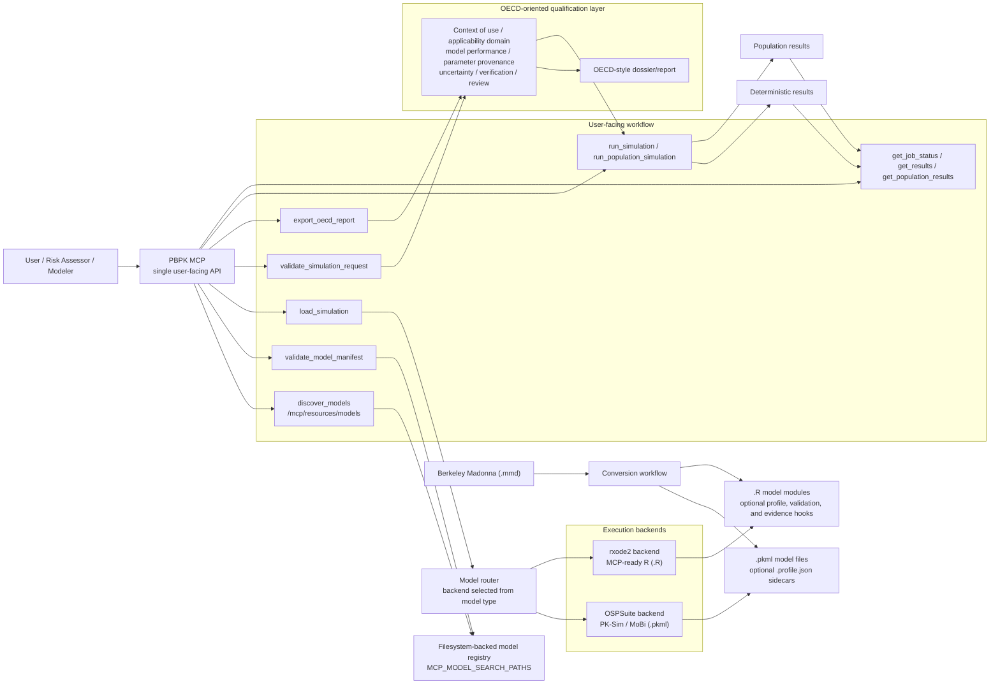
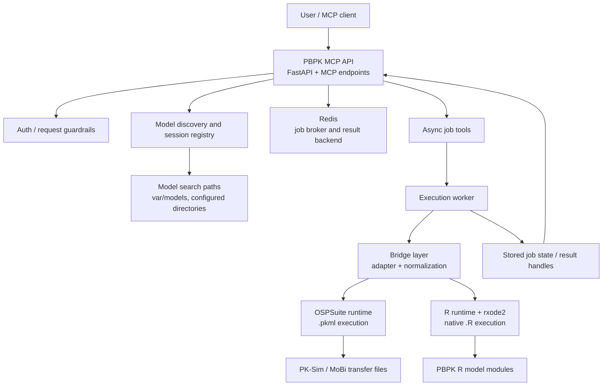

# Dual-Backend PBPK MCP

## Status

Current architecture and near-term operating model for this workspace.

This document describes the current direction of PBPK MCP as it is implemented today:

- `.pkml` models run through `ospsuite`
- MCP-ready `.R` PBPK models run through `rxode2`
- discovery is filesystem-backed
- OECD-oriented qualification metadata is exposed separately from runtime execution
- Berkeley Madonna `.mmd` remains a conversion source, not a runtime format
- the current contract-convergence stage uses a packaged `src/` runtime by default, with a thinner local source-overlay profile available only for workspace iteration

## Product Positioning

PBPK MCP should remain one user-facing MCP product.

Users should think in terms of:

- discover a model
- validate the model manifest
- load it
- validate the intended use
- run the model
- inspect results
- export a qualification-oriented report when needed

They should not have to choose a separate server for PK-Sim, MoBi, or native R-authored PBPK models.

The internal architecture should therefore keep:

- one user-facing MCP/API surface
- explicit but automatic backend routing
- explicit capability reporting
- explicit scientific qualification boundaries

## Contract-Convergence Stage

The `v0.3.x` line started as a contract-convergence milestone, and the `0.4.x` line is now reducing the packaging debt behind that contract.

For this stage:

- the live MCP surface is defined by the packaged `src/` implementation, with an optional local `/app/src` source overlay only for explicit maintainer development
- the worker image carries the baseline runtime assets directly
- the compose-based local stack uses direct bind mounts and a `.pth` overlay hook instead of patch-copying files into running containers

This is deliberate because the published PBPK workflow and the live tests were already aligned around the converged public contract, while a full packaging cleanup still needs to happen carefully.

The current maintainability rule is:

- change the canonical generic runtime contract in `src/`
- keep runtime-specific local operator logic in the deploy scripts, worker image, and overlay hook rather than a tracked patch implementation layer
- verify it on the live stack
- keep shrinking the remaining runtime-specific overlay surface until the packaged boundary is authoritative by default

## Logical Architecture



This is the public-facing story:

- one MCP
- two runtime backends
- one qualification layer
- one explicit conversion boundary for unsupported source formats

The typed PBPK-side NGRA objects now carry explicit handoff semantics as well:

- `assessmentBoundary` identifies what PBPK MCP is actually claiming for a given object
- `decisionBoundary` makes it explicit that BER calculation and NGRA decision policy remain external
- `supports` flags tell downstream orchestrators which PBPK-side capabilities are actually present versus absent
- `assessmentContext.workflowRole` makes the exposure-led NGRA role and non-goals explicit
- `assessmentContext.populationSupport` makes supported populations and extrapolation boundaries explicit
- `pbpkQualificationSummary.evidenceBasis` makes no-direct-in-vivo support, IVIVE linkage status, and parameterization basis explicit when declared
- `pbpkQualificationSummary.workflowClaimBoundaries` makes forward-dosimetry support, reverse-dosimetry limits, and no-direct-dose-derivation boundaries explicit
- `pointOfDepartureReference` makes external PoD provenance explicit without turning PBPK MCP into the owner of PoD interpretation or BER policy
- `uncertaintyHandoff` makes PBPK-to-cross-domain uncertainty transfer explicit without turning PBPK MCP into the owner of uncertainty synthesis
- `uncertaintyRegisterReference` makes an external cross-domain uncertainty register reference explicit without turning PBPK MCP into the owner of that register

## Role in Exposure-led NGRA

PBPK MCP should be treated as a PBPK-side execution and handoff layer inside an exposure-led NGRA workflow.

- It owns PBPK execution, PBPK-side qualification, PBPK-side internal exposure estimates, and typed handoff objects.
- It depends on upstream exposure, IVIVE, PoD, and broader WoE interpretation that remain outside PBPK MCP.
- It can support forward-dosimetry-style external-dose to internal-exposure translation.
- It does not directly own reverse dosimetry, exposure-led prioritization policy, or direct regulatory dose derivation.

See [exposure_led_ngra_role.md](exposure_led_ngra_role.md) for the repo-grounded boundary statement.

## Runtime Deployment



This deployment view matters because the dependency profile is not symmetric:

- `ospsuite` and `rxode2` do not have the same runtime footprint
- `rxode2` package builds are heavy and should be prebuilt into an image
- the user-facing API should stay stable even if worker images diverge
- the local stack currently relies on a shared runtime patch manifest so image builds and hot patches apply the same contract surface

## Design Goals

- Keep one user-facing MCP surface.
- Preserve a clean PK-Sim and MoBi experience for `.pkml`.
- Support native R-authored PBPK models through `rxode2`.
- Make qualification state explicit rather than implied.
- Keep discovery generic across supported model files.
- Allow backend-specific capabilities without fragmenting the product.

## Non-Goals

- Raw Berkeley Madonna `.mmd` execution.
- Treating runnable as equivalent to qualified.
- Pretending `.pkml` and `.R` models are internally identical.
- Forcing every backend to support every advanced workflow.

## Supported Model Types

### Direct runtime support

- `.pkml` via `ospsuite`
- `.R` via the PBPK R model-module contract

### Conversion-source only

- `.mmd`
- `.pksim5` project files unless exported to `.pkml`

The MCP should not silently convert unsupported source formats during `load_simulation`.

## Canonical Concepts

### Model session

A loaded model instance tracked by `simulationId`.

### Backend

The execution engine selected for a loaded model.

Current backend values:

- `ospsuite`
- `rxode2`

### Capabilities

Operational behavior flags such as:

- deterministic-run support
- population-run support
- chunked population-result support
- parameter editing support

### Scientific profile

Qualification-oriented metadata such as:

- `contextOfUse`
- `applicabilityDomain`
- `modelPerformance`
- `parameterProvenance`
- `uncertainty`
- `implementationVerification`
- `platformQualification`
- `peerReview`
- `profileSource`
- `qualificationState`

### Validation assessment

A preflight decision about whether a requested use is within declared guardrails or outside the model's declared profile.

This is not the same as a regulatory approval statement.

### NGRA-ready PBPK objects

PBPK MCP can now derive typed PBPK-side objects for downstream workflow orchestration:

- `assessmentContext`
- `pbpkQualificationSummary`
- `uncertaintySummary`
- `uncertaintyHandoff`
- `internalExposureEstimate`
- `uncertaintyRegisterReference`
- `pointOfDepartureReference`
- a thin `berInputBundle` in dossier export

These objects are intended to make PBPK outputs composable in downstream orchestrators without moving BER policy or broader decision logic into PBPK MCP itself.

PBPK MCP can now also normalize externally generated PBPK outputs into the same object family through `ingest_external_pbpk_bundle`. This is an interoperability/import path, not a third execution backend.

## Common Contract

Every loaded model should expose one stable high-level handle shape.

Illustrative example:

```json
{
  "simulationId": "reference-compound-rxode2",
  "backend": "rxode2",
  "contractVersion": "pbpk-mcp.v1",
  "metadata": {
    "name": "reference_compound_population_rxode2_model.R",
    "engine": "rxode2"
  },
  "capabilities": {
    "supportsParameterEditing": true,
    "supportsDeterministicRuns": true,
    "supportsPopulationRuns": true,
    "supportsChunkedPopulationResults": true
  },
  "profile": {
    "contextOfUse": {
      "regulatoryUse": "research-only"
    },
    "applicabilityDomain": {
      "qualificationLevel": "research-use"
    }
  }
}
```

The important architectural rule is:

- `capabilities` describe runtime behavior
- `profile` describes scientific qualification status

Those must stay separate.

## Tool Surface

### Common tools

These are intended to remain shared across both backends:

| Tool | Purpose | `ospsuite` | `rxode2` |
| --- | --- | --- | --- |
| `discover_models` | Discover supported model files on disk | Yes | Yes |
| `validate_model_manifest` | Run a static model-manifest check before load | Yes | Yes |
| `load_simulation` | Load a model by file path | Yes | Yes |
| `list_parameters` | Enumerate parameters | Yes | Yes |
| `get_parameter_value` | Read one parameter | Yes | Yes |
| `set_parameter_value` | Write one parameter | Yes | Yes |
| `validate_simulation_request` | Assess intended use and guardrails | Yes | Yes |
| `run_verification_checks` | Run executable verification checks with unit/flow-volume/integrity/reproducibility summaries | Yes | Yes |
| `run_simulation` | Run one deterministic simulation | Yes | Yes |
| `get_job_status` | Inspect job state | Yes | Yes |
| `get_results` | Retrieve deterministic results | Yes | Yes |
| `export_oecd_report` | Export a structured qualification report | Yes | Yes |

### Backend-specific tools

These should remain backend-specific unless semantics converge later:

| Tool | Purpose | `ospsuite` | `rxode2` |
| --- | --- | --- | --- |
| `run_population_simulation` | Run cohort/population workflow | No | Yes |
| `get_population_results` | Retrieve population aggregates and chunks | No | Yes |

## Behavioral Rules

### 1. Backend must always be explicit

`load_simulation` should always report the selected backend.

### 2. Capability failures must be actionable

Unsupported operations should fail with an explicit capability-oriented error, not a vague backend crash.

### 3. Parameter paths stay canonical

Even when internal implementation differs, MCP parameter access should remain path-based and stable.

### 4. Result types stay distinct

Deterministic and population results should remain separate payload shapes.

### 5. No silent format coercion

The MCP should not silently accept `.mmd` or `.pksim5` and invent runtime behavior.

### 6. Qualification is advisory, not hidden execution logic

Validation and dossier export should inform the user clearly, but scientific qualification should not be disguised as a runtime success flag.

## Backend Capability Matrix

For the adoption-facing published matrix, see `docs/architecture/capability_matrix.md` and `docs/architecture/capability_matrix.json`.

Current capability model:

| Capability | Meaning | `ospsuite` | `rxode2` |
| --- | --- | --- | --- |
| `supportsParameterEditing` | Can edit model parameters through MCP | Yes | Yes |
| `supportsDeterministicRuns` | Can run one simulation and return time-series data | Yes | Yes |
| `supportsPopulationRuns` | Can run cohort sampling and simulation | No | Yes |
| `supportsChunkedPopulationResults` | Can return chunk handles for population payloads | No | Yes |
| `supportsUnitAwareParameters` | Tool can reliably round-trip explicit units | Yes | Partial |
| `supportsQualificationExport` | Can export an OECD-style report | Yes | Yes |

The exact list can grow, but it should remain compact and operational.

## R Model-Module Contract

The `.R` path is formalized around a PBPK R model-module contract.

Common hooks:

- `pbpk_model_metadata()`
- `pbpk_parameter_catalog()`
- `pbpk_default_parameters()`
- `pbpk_run_simulation(parameters, simulation_id = NULL, run_id = NULL, request = list())`
- `pbpk_run_population(parameters, cohort = list(), outputs = list(), simulation_id = NULL, request = list())`

Qualification-oriented hooks:

- `pbpk_model_profile()`
- `pbpk_validate_request(request)`
- `pbpk_parameter_table(...)`
- `pbpk_performance_evidence(...)`

Optional operational hooks:

- `pbpk_capabilities()`
- `pbpk_supported_outputs()`

Recommended semantic split:

- `pbpk_capabilities()`
  - operational MCP behavior
- `pbpk_model_profile()`
  - scientific context-of-use and qualification metadata
- `pbpk_validate_request()`
  - request-level assessment of guardrails and declared applicability
- `pbpk_parameter_table()`
  - dossier-oriented parameter provenance export
- `pbpk_performance_evidence()`
  - observed-versus-predicted or other model-performance evidence rows

## OECD-Oriented Qualification Layer

The current qualification model is intentionally broader than runtime bounds.

It aims to support:

- context of use
- applicability domain
- model performance and predictivity
- parameter provenance
- uncertainty and sensitivity characterization
- implementation verification
- peer review and prior use
- reporting and traceability

Current MCP surfaces for this layer:

- `validate_model_manifest`
- `validate_simulation_request`
- `run_verification_checks`
- `export_oecd_report`

The qualification layer now also derives an explicit `qualificationState`, such as:

- `exploratory`
- `illustrative-example`
- `research-use`
- `regulatory-candidate`
- `qualified-within-context`

The important boundary remains:

- qualification metadata can be complete while evidence is incomplete
- runtime guardrails can pass while regulatory suitability remains unproven

## Current Limitations

### Format limitations

- Berkeley Madonna `.mmd` is not directly executable
- `.pksim5` is not directly executed and should be exported to `.pkml`
- an `.R` file can be discoverable without being runnable if it does not implement the expected contract

### Capability limitations

- population simulation is currently implemented for `rxode2`, not generic OSPSuite `.pkml`
- backend capability sets are intentionally not identical
- `run_verification_checks` is a lightweight runtime-verification surface; it includes parameter-unit consistency, structural flow/volume consistency, smoke, integrity, and reproducibility checks, but it does not replace a full implementation-verification dossier, software-platform qualification package, or external qualification package
- `rxode2` models may optionally contribute model-specific executable qualification checks through a runtime hook; these are useful for checks such as flow/volume consistency, mass balance, or solver-stability heuristics, but they are still implementation evidence rather than a blanket qualification claim
- some OSPSuite transfer files still rely on runtime output-selection fallbacks
- static manifest validation for `.R` models is text and hook based before load, not a semantic proof of execution correctness

### Qualification limitations

- runtime success is not evidence of external model qualification
- some example profiles remain `illustrative-example` or `research-use`
- `modelPerformance` and `parameterProvenance` may still be partially populated rather than dossier-complete
- exported performance evidence may still reflect smoke or internal evidence instead of full observed-versus-predicted packages

### Operational limitations

- `rxode2` worker images should be prebuilt because package compilation is heavy
- laptop deployments should keep conservative worker memory caps
- the API surface is unified, but worker images may diverge further as runtimes evolve

## Current Implementation Notes

These parts are already implemented in this workspace:

- extension-based backend routing in `scripts/ospsuite_bridge.R`
- `.R` acceptance in `load_simulation`
- filesystem-backed discovery through `/mcp/resources/models` and `discover_models`
- capability-aware validation and OECD-style profile export
- sidecar-backed scientific metadata for `.pkml` models
- structured OECD dossier export through `export_oecd_report`, including stored executable-verification snapshots when `run_verification_checks` has already been run for that simulation and an additive `oecdCoverage` map for OECD Tables 3.1/3.2

## Recommended Near-Term Work

1. Add broader model-performance datasets and acceptance criteria.
2. Add quantitative uncertainty and sensitivity result export.
3. Add stronger implementation-verification evidence and regression bundles.
4. Keep sidecar and R-model qualification metadata examples honest and non-inflated.
5. Continue expanding end-to-end live tests across representative PK-Sim, MoBi, and native R models.

## Decision Summary

The right architecture remains:

- one `PBPK MCP`
- multiple explicit execution backends
- one shared user workflow
- one explicit qualification layer
- one explicit conversion boundary for unsupported source formats

That keeps the product accessible while still making it useful for OECD-oriented review and, over time, more defensible for regulatory decision support.
